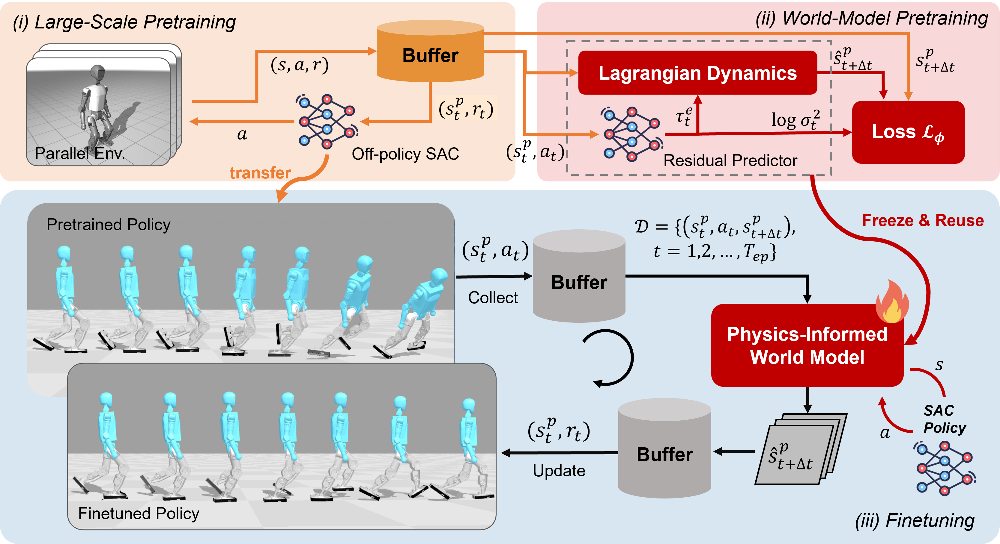
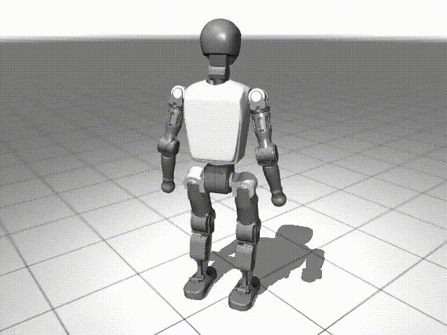
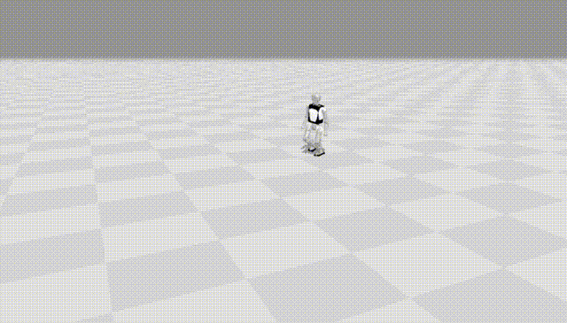
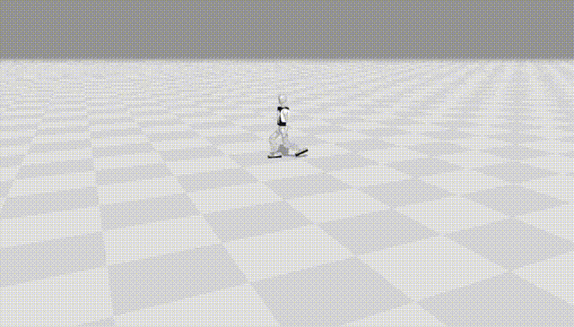
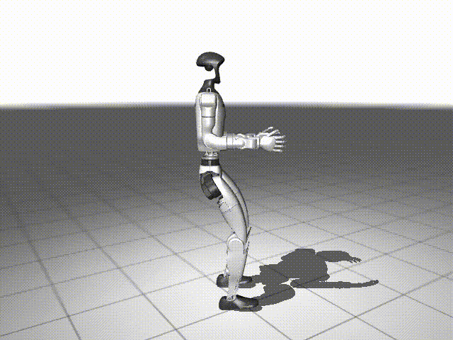
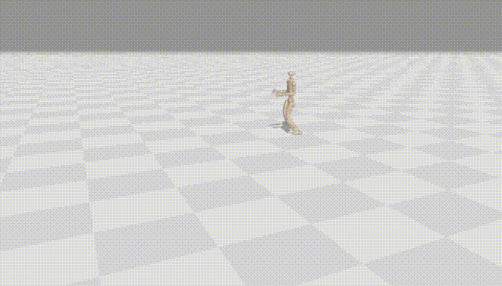
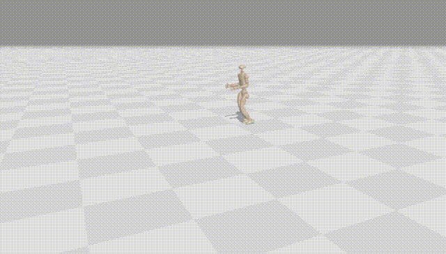
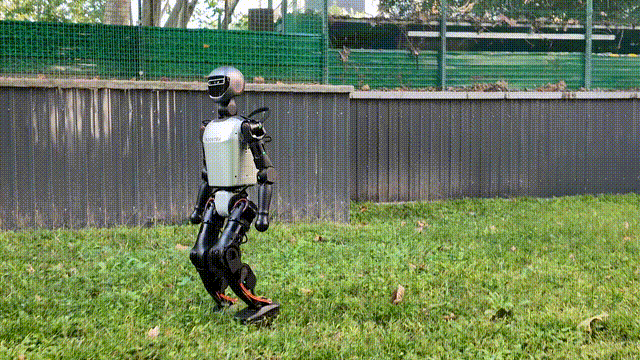

<div align="center">
  <h1 align="center">LIFT: Large-scale Pretraining & Efficient Finetuning for Humanoid Control</h1>

</div>

<p align="center">
  
</p>
<p align="center">
  <strong>Codebase for LIFT — large-batch, high-UTD SAC pretraining + physics-informed world-model finetuning for humanoid control (Booster T1 / Unitree G1).</strong>
</p>


---

<div align="center">

| <div align="center"> MuJoCo Playground (Pretrain) </div> | <div align="center"> Brax (Sim2Sim) </div> |  <div align="center"> Brax (After Finetuning) </div> |
|--- | --- | --- |
| [](assets/video/t1_mj_lowdim_flat_comp.gif) | [](assets/video/t1_1.5vel_pretrain.gif) | [](assets/video/t1_1.5vel_finetune.gif) |
| [](assets/video/g1_mj_lowdim_flat.gif) | [](assets/video/g1_1.5vel_pretrain.gif) | [](assets/video/g1_1.5vel_finetune.gif) |

</div>

---

## 📦 Installation & Configuration

(Ubuntu 20.04 and Python 3.10 recommended). Minimal quickstart:

```bash
conda create -n lift python=3.10 -c conda-forge -y
conda activate lift
cd mujoco_playground
pip install -e .
cd ..
cd brax_env
pip install -e .
cd ..
pip install -r requirements.txt

```

## 🔁 Process Overview

**Train Policy → Pretrain World Model → Finetune**

* **Train Policy**: pretrain with SAC (large batch + high UTD) in MuJoCo Playground and zero-shot deployment of pretrained policy on physical humanoids.

* **Pretrain World Model**: pretrain the physics-informed world model using the SAC offline data.

* **Sim2Sim and Finetune**: transfer the pretrained policy to Brax and **finetune** with a physics-informed world model.
  Environment executes **deterministic** actions; **stochastic exploration** is confined to the world model.


---

## 1) Training Policy (MuJoCo Playground)

Start large-scale SAC pretraining:

```bash
# If EGL is available (recommended on headless GPU servers):
export MUJOCO_GL=egl
# else use software rendering:
export MUJOCO_GL=osmesa

# Metrics are logged to Weights & Biases (W&B).
# Replace <your_wandb_entity> with your W&B entity (org or username).

# T1LowDimJoystickRoughTerrain
CUDA_VISIBLE_DEVICES=0 python train_in_mujoco_playground.py --env_name=T1LowDimJoystickRoughTerrain --use_wandb --wandb_entity your_wandb_entity --domain_randomization --suffix xxx

# T1LowDimJoystickFlatTerrain
CUDA_VISIBLE_DEVICES=0 python train_in_mujoco_playground.py --env_name=T1LowDimJoystickFlatTerrain --use_wandb --wandb_entity your_wandb_entity --domain_randomization --suffix xxx

# G1JoystickFlatTerrain
CUDA_VISIBLE_DEVICES=0 python -u train_in_mujoco_playground.py --env_name=G1JoystickFlatTerrain --use_wandb --wandb_entity your_wandb_entity  --suffix xxx

# G1JoystickRoughTerrain
CUDA_VISIBLE_DEVICES=0 python train_in_mujoco_playground.py --env_name=G1JoystickRoughTerrain --use_wandb --wandb_entity your_wandb_entity  --suffix xxx

# T1JoystickRoughTerrain
CUDA_VISIBLE_DEVICES=0 python train_in_mujoco_playground.py --env_name=T1JoystickRoughTerrain --use_wandb --wandb_entity your_wandb_entity  --suffix xxx

# T1JoystickFlatTerrain
CUDA_VISIBLE_DEVICES=0 python train_in_mujoco_playground.py --env_name=T1JoystickFlatTerrain --use_wandb --wandb_entity your_wandb_entity  --suffix xxx

# G1LowDimJoystickFlatTerrain  (prepared for Brax finetune; see notes below)
CUDA_VISIBLE_DEVICES=0 python train_in_mujoco_playground.py --env_name=G1LowDimJoystickFlatTerrain --domain_randomization --use_wandb --wandb_entity your_wandb_entity  --suffix xxx --num_timesteps 40000000 --num_evals 10 --save_buffer_data

# T1LowDimSimpRewJoystickFlatTerrain  (prepared for Brax finetune; see notes below)
CUDA_VISIBLE_DEVICES=0 python train_in_mujoco_playground.py --env_name=T1LowDimSimpRewJoystickFlatTerrain --domain_randomization --use_wandb --wandb_entity your_wandb_entity  --suffix xxx --num_timesteps 40000000 --num_evals 10 --save_buffer_data
````

### Common flags

> **Note:** The script uses `--env_name` (not `--env`).
> Throughput/stability knobs for SAC are mainly `--num_envs`, `--batch_size`, and `--grad_updates_per_step`.

* `--env_name`: Environment name (must be in `mujoco_playground.registry.ALL_ENVS`), e.g.
  `T1LowDimJoystickRoughTerrain`, `T1LowDimJoystickFlatTerrain`,
  `G1JoystickFlatTerrain`, `G1JoystickRoughTerrain`,
  `T1JoystickFlatTerrain`, `T1JoystickRoughTerrain`,
  `G1LowDimJoystickFlatTerrain`, `T1LowDimSimpRewJoystickFlatTerrain`.
* `--num_timesteps`: Total env steps to train. For large pretraining, consider ≥4e7 (small runs) up to 5e9 (long runs).
* `--num_envs`: Number of parallel envs (sampling bandwidth). Typical: `1024/2048/4096`.
* `--batch_size`: Samples per gradient step (VRAM-bound). Typical: `8192/16384/32768`.
* `--grad_updates_per_step`: UTD ratio (updates per env step). Typical: `8–24`; too high can reduce stability.
* `--discounting`: Discount factor (e.g., `0.982–0.995`).
* `--tau`: Target-network EMA coefficient (e.g., `0.002–0.01`); smaller = more stable targets.
* `--reward_scaling`: Reward scale; larger values often help low-dim tasks (e.g., `16` or `32`).
* `--learning_rate`: Global LR placeholder (if you override per-module LRs from the config).
* `--seed`: Random seed for reproducibility.
* `--suffix`: Suffix appended to the experiment name (helps differentiate runs).
* `--use_wandb`: Enable Weights & Biases logging (set `WANDB_PROJECT`/`WANDB_ENTITY` beforehand).
- `--wandb_entity`: Your W&B **entity** (username or org) that owns the project. Overrides `WANDB_ENTITY`.
* `--render`: Periodically render evaluation rollouts to MP4 under `logs/.../videos/`
  (use `MUJOCO_GL=osmesa` on headless machines).
* `--save_buffer_data`: Persist SAC replay data to `logs/.../buffer_data/` for later analysis/finetune.
* Other flags directly map to the trainer config:
  `--normalize_observations`, `--action_repeat`, `--episode_length`,
  `--max_replay_size`, `--log_alpha`, `--num_evals`,
  `--policy_hidden_layer_sizes`, `--value_hidden_layer_sizes`,
  `--policy_obs_key`, `--value_obs_key`.

**Environment variables**

* `MUJOCO_GL=egl | osmesa`: Rendering backend (EGL for GPU servers, OSMesa for pure software).
* `CUDA_VISIBLE_DEVICES=0`: Choose the GPU index.

### Outputs & structure

Training logs and artifacts are saved under:

```
logs/
  <ENV>-<YYYYmmdd-HHMMSS>-<suffix?>/
    checkpoints/     # config snapshot (e.g., config.json)
    policies/        # policy{step}.pkl (normalizer + policy params via dill)
    videos/          # rollout{step}.mp4 (if --render)
    buffer_data/     # saved replay (if --save_buffer_data)
```

### Brax finetune preparation

The following **MuJoCo Low-Dim, Flat** environments are intended as **pretraining sources for Brax finetuning**.
They produce stable gaits suitable for sim-to-sim transfer:

* **`G1LowDimJoystickFlatTerrain`** – low-dim observables on flat terrain; great to pretrain a robust policy, then carry weights/normalizer (and optionally buffer) into **Brax** for finetune.
* **`T1LowDimSimpRewJoystickFlatTerrain`** – T1 flat terrain with **simplified reward**; converges faster and more stably, ideal as a starting point before turning in Brax.


---

### 2.Evaluate pretrained and finetuned policies (Brax)

**Model naming**
- `*_0.pkl`: direct **sim-to-sim zero-shot** from MuJoCo to Brax (no Brax training).
- `*_40000.pkl`: finetuned in brax after 40,000 env steps.

**Note**
- Rendering exports to HTML
-  Pretraining sampled x-vel uniformly in `[-1, 1] m/s`. In finetuning, set new targets (e.g., `1.0/1.2/1.5 m/s`).
-  Keep exploration **inside** the world model for safety; the environment executes **deterministic** actions.
**Examples**

```bash
# G1 — zero-shot sim2sim
python eval_in_brax.py --env g1 --model models/g1_0.pkl --out g1_0.html

# G1 — Brax 40k-step finetune
python eval_in_brax.py --env g1 --model models/g1_40000.pkl --out g1_40000.html

# T1 — zero-shot sim2sim
python eval_in_brax.py --env t1 --model models/t1_0.pkl --out t1_0.html

# T1 — Brax 40k-step finetune
python eval_in_brax.py --env t1 --model models/t1_40000.pkl --out t1_40000.html

# Open the HTML in your default browser (Linux)
xdg-open t1_40000.html

```

---
### 3.Todo List:

1. **World model pretraining**

2. **World model & policy finetune (Brax)**

3. **Sim2Real deployment**

4. **Optuna hyper-parameter tuning  example for LIFT**

All code will be open-sourced **after paper acceptance**.

[](assets/video/T1_walk_on_grass_h264.gif)


---

## 🙏 Acknowledgments

We build upon and/or interface with: **Brax**, **Optuna**, **Flax/JAX**, **MuJoCo Playground**, **BoosterGym**, **Unitree RL gym**.
Thanks to the open-source community for foundational tooling and datasets.

---


